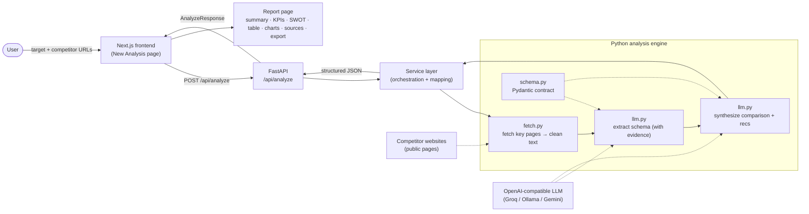

# InsightEngine AI — Competitor Intelligence

A full-stack AI competitor-research app. Give it a business and a few competitor
websites; it reads their **public pages**, analyzes each one against a fixed set
of criteria — with a **source quote behind every claim** — and produces a
comparison and strategic recommendations.

- **Frontend:** Next.js 15 (App Router) · TypeScript · Tailwind · TanStack Query · React Hook Form + Zod · Recharts · Framer Motion · Lucide
- **Backend:** FastAPI wrapping a Python analysis engine (fetch → LLM extraction → synthesis)
- **LLM:** any OpenAI-compatible provider (defaults to free **Groq**); swappable to Ollama/Gemini via env
- **Cost:** runs entirely on free tiers

---

## Architecture



Text version of the same flow:

```
User → [Next.js: New Analysis] → POST /api/analyze → [FastAPI]
                                                        │
                                                        ▼
                                   ┌──────── Python engine ────────┐
   competitor sites ┄┄┄▶ fetch.py ─▶ llm.py (extract) ─▶ llm.py (synthesize)
        (public)          (text)        │  ▲                    │
   free LLM API ┄┄┄┄┄┄┄┄┄┄┄┄┄┄┄┄┄┄┄┄┄┄┘  └── schema.py (contract)┘
                                                        │
                                          structured JSON (AnalyzeResponse)
                                                        ▼
                                   [Next.js: Report page] → export MD / JSON / PDF
```

### How the engine works

1. **Collect** — for each URL, `fetch.py` pulls a few key pages (home, services,
   about, pricing, contact), strips them to clean text, and records a
   `fetchStatus` (`ok` / `partial` / `failed`) so a dead site degrades gracefully.
2. **Extract** — `llm.py` sends each site's text to the LLM and fills a fixed
   schema (overview, services, audience, structure, content strategy, SEO, USP,
   pricing, strengths, weaknesses). Every analyzed field carries a **verbatim
   quote + source page**; missing data (e.g. pricing) is recorded as
   "not publicly listed," never invented.
3. **Synthesize** — one final LLM call compares all competitors against the
   target (matched by stable IDs) and returns the comparison, recommendations,
   and per-competitor opportunities.
4. **Serve** — the FastAPI service maps the engine's records into a camelCase
   `AnalyzeResponse`; the frontend renders it into the report.

---

## Project structure

```
competitor-intel/
├── backend/
│   ├── app/
│   │   ├── main.py         # FastAPI app + /api/analyze
│   │   ├── service.py      # orchestration + engine→API mapping
│   │   ├── schemas.py      # API request/response models (the contract)
│   │   └── engine/         # the analysis engine (fetch, llm, schema)
│   ├── requirements.txt
│   └── .env.example
└── frontend/
    ├── app/                # routes: / (New Analysis), /report
    ├── components/         # layout · analysis · dashboard · report · charts
    ├── lib/                # api client · mock data · export · utils
    ├── types/report.ts     # TS mirror of the API contract
    └── package.json
```

---

## Run locally

**Backend** (terminal 1):
```bash
cd backend
python -m venv .venv && source .venv/bin/activate   # Windows: .venv\Scripts\activate
pip install -r requirements.txt
cp .env.example .env        # paste a free Groq key (https://console.groq.com/keys)
uvicorn app.main:app --reload --port 8000
```

**Frontend** (terminal 2):
```bash
cd frontend
npm install
cp .env.local.example .env.local
# .env.local: NEXT_PUBLIC_USE_MOCK=true renders sample data with no backend;
# set it to false to call the real backend at NEXT_PUBLIC_API_BASE_URL.
npm run dev
```

Open http://localhost:3000.

---

## Deploy (free tiers)

**Backend → Render (or Railway):**
1. Push this repo to GitHub.
2. New Web Service → point at `backend/`.
3. Build: `pip install -r requirements.txt` · Start: `uvicorn app.main:app --host 0.0.0.0 --port $PORT`
4. Add env vars from `.env.example` (your `LLM_API_KEY`, etc.). Copy the service URL.

**Frontend → Vercel:**
1. New Project → point at `frontend/`.
2. Env: `NEXT_PUBLIC_API_BASE_URL` = your Render URL, `NEXT_PUBLIC_USE_MOCK=false`.
3. Deploy.
4. In the backend, restrict CORS `allow_origins` to your Vercel domain.

> Free Python hosts sleep when idle, so the first request after a pause is slow.
> The analysis is a single blocking call (~1–2 min); streaming per-stage progress
> is a planned enhancement.

---

## Screenshots

Add PNGs to `docs/screenshots/` and they'll render here:


---

## Notes & scope

- Uses only publicly available page content; nothing behind logins.
- Charts are derived from **real extracted data** (counts/coverage), not
  fabricated market metrics.
- The floating assistant is a UI stub; a conversational layer is on the roadmap.
